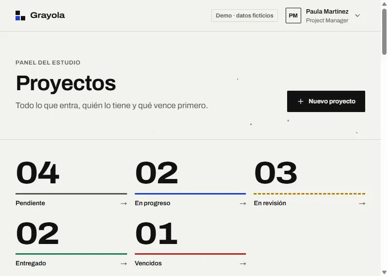
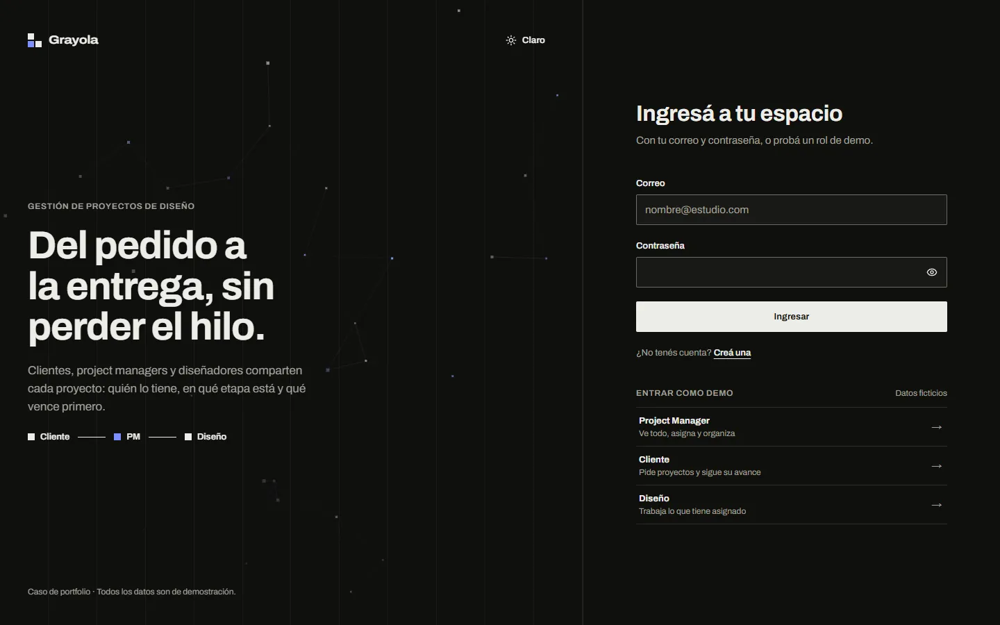
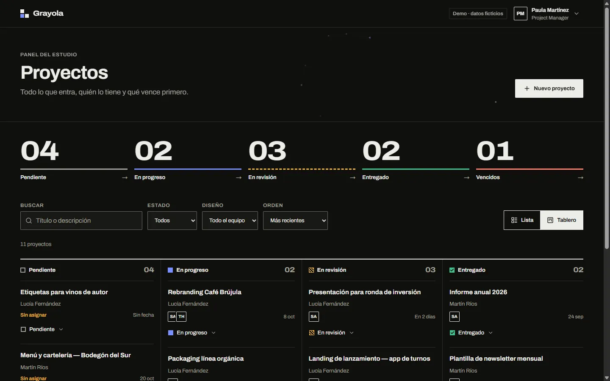
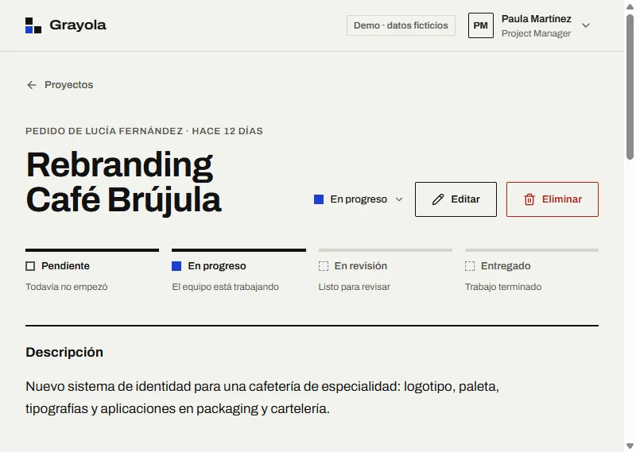
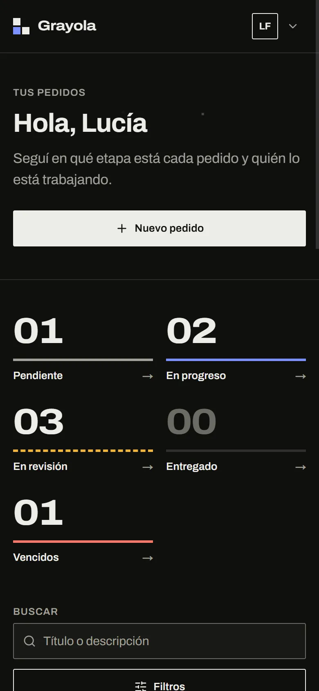

# Grayola · Gestión de proyectos de diseño

**Del pedido a la entrega, sin perder el hilo.** Una herramienta para un estudio de diseño en la que los clientes piden proyectos, el Project Manager los asigna y los diseñadores los trabajan. Cada rol tiene su propia vista, y los permisos se aplican de verdad en la base de datos.

> Nació como prueba técnica para Grayola y la rehice de punta a punta como caso de portfolio: backend reconstruido con migraciones versionadas y RLS por rol, sistema visual propio y tests E2E. No es un producto oficial de Grayola y todos los datos son ficticios.

**Demo:** [grayola-app.vercel.app](https://grayola-app.vercel.app) · En el login vas a encontrar el acceso **"Entrar como demo"** para cada rol.



| | |
|---|---|
|  |  |
|  |  |

## Qué hace cada rol

| | Cliente | Diseño | Project Manager |
|---|---|---|---|
| Ve | Sus pedidos | Los proyectos asignados | Todos |
| Crea proyectos | Sí (sin asignar) | No | Sí |
| Cambia el estado | No | Solo de sus asignados | Sí |
| Edita, asigna, elimina | No | No | Sí |
| Sube archivos | A sus proyectos | No | Sí |
| Primera pantalla | Etapa de cada pedido y quién lo trabaja | Su trabajo ordenado por entrega | Contadores, lista o tablero, filtros |

Los estados de un proyecto son **Pendiente → En progreso → En revisión → Entregado**, con fecha de entrega, archivos privados e historial de actividad.

## Stack

- **Next.js 16** (App Router, Server Components, Server Actions, `proxy.ts`) con **React 19** y **TypeScript** estricto.
- **Supabase**: Auth, PostgreSQL con **Row Level Security**, Storage con bucket privado y **URLs firmadas**, y tipos generados.
- **Tailwind CSS 4** con tokens propios y primitivas estilo shadcn sobre **Radix UI**.
- **React Hook Form** + **Zod 4**, validando en cliente y en servidor.
- **tsParticles 4** (engine *slim*), **Motion**, **Sonner**, **next-themes** y **date-fns**.
- **Playwright** para E2E. Deploy en **Vercel**.

## Seguridad

La UI oculta lo que un rol no puede hacer, pero la autorización real está en el servidor, en tres capas:

1. **Server Actions**: validan la entrada con Zod y verifican el rol (`requireRole`) antes de tocar la base.
2. **RLS en Postgres**: cada tabla y el Storage filtran por rol y por relación con el proyecto. El rol del perfil no se puede editar desde la app (privilegio de columna), y un trigger impide que un diseñador cambie algo que no sea el estado.
3. **Storage privado**: sin URLs públicas. Las subidas usan URLs firmadas de un solo uso y las descargas, enlaces que vencen en 60 segundos.

Las funciones auxiliares viven en un schema `private` que no se expone como RPC, y el historial de actividad lo escriben solo triggers. Además, el proxy valida el JWT con `getClaims()` y la app envía headers de seguridad.

## Arquitectura

```
app/
  (auth)/login, register          pantallas públicas (fondo de partículas "hero")
  (app)/proyectos                 dashboard por rol · ?status ?q ?designer ?sort ?view
  (app)/proyectos/[id]            detalle: etapas, archivos, historial
  (app)/proyectos/nuevo, [id]/editar, perfil
  loading / error / not-found     estados con la forma real del contenido
features/{projects,files,auth,users}/
  actions.ts   Server Actions (Zod + requireRole + RLS)
  queries.ts   lecturas server-only
  schemas.ts   Zod compartido cliente/servidor
components/ui/      primitivas del sistema
components/*/       dominio: StatusControl, ProjectTable, ProjectBoard, FileDropzone…
lib/supabase/       clientes server/browser/proxy (@supabase/ssr)
lib/auth/session.ts getCurrentUser (cacheado por request) y requireRole
supabase/migrations + rollbacks + seed.sql
types/database.ts   generado desde Supabase
e2e/                Playwright
```

## Decisiones de diseño

La dirección visual es la **Grilla Suiza**: papel y tinta, una grilla de 12 columnas y tipografía como estructura, con el color reservado para señalar estados. La elegí para que una herramienta de estudio de diseño se sienta como un objeto de su propio mundo, y no como un dashboard SaaS genérico. El detalle de tokens, tipografía, movimiento y contraste está en [DESIGN.md](DESIGN.md).

- **Estados por forma, no solo por color** (contorno, lleno, rayado, tilde), y todos los pares de color pasan AA en ambos temas.
- **El fondo de partículas es parte de la identidad.** La variante "Ruta" dibuja nodos que se conectan como la ruta de un pedido. Se carga en diferido y, al cambiar de tema, se transiciona con un filtro de CSS sin reiniciarse. Respeta `prefers-reduced-motion`.
- **Accesibilidad WCAG 2.2 AA:** foco visible, uso completo con teclado, errores anunciados junto al campo, objetivos de 44 px y link para saltar al contenido.

**Calidad medida** sobre el build de producción: Lighthouse 100 en Accesibilidad, Buenas prácticas y SEO; en el login, LCP de 394 ms y CLS 0 con CPU ×4 y 4G, con partículas activas.

## Correrlo localmente

Requisitos: Node 20.9 o superior y un proyecto de Supabase.

```bash
git clone https://github.com/FelipeJuaneda/grayola-app.git
cd grayola-app
npm install
cp .env.example .env.local   # completá URL y publishable key de tu proyecto
```

1. **Base de datos.** Aplicá en orden los archivos de `supabase/migrations` (con Supabase CLI, `supabase db push`, o pegándolos en el SQL Editor). Después corré `supabase/seed.sql` para crear los usuarios y proyectos demo. Cada migración tiene su reversión en `supabase/rollbacks`.
2. **App:**

```bash
npm run dev
```

| Script | Qué hace |
|---|---|
| `npm run dev` | Servidor de desarrollo |
| `npm run build` / `npm start` | Build y servidor de producción |
| `npm run typecheck` | TypeScript sin emitir |
| `npm run lint` | ESLint |
| `npm run format` | Prettier (con orden de clases de Tailwind) |
| `npm run test:e2e` | Playwright contra el build (`npm run build` antes) |

### Variables de entorno

| Variable | Descripción |
|---|---|
| `NEXT_PUBLIC_SUPABASE_URL` | URL del proyecto Supabase |
| `NEXT_PUBLIC_SUPABASE_PUBLISHABLE_KEY` | Publishable key (o la anon key legacy) |
| `NEXT_PUBLIC_SITE_URL` | URL pública, para metadata y Open Graph |
| `DEMO_ACCESS` | `off` desactiva el acceso de demo en un clic |
| `DEMO_PASSWORD` | Contraseña de las cuentas demo (por defecto `123456`) |

### Usuarios de prueba

Todos usan la contraseña `123456`.

| Rol | Correo |
|---|---|
| Project Manager | `pm@gmail.com` |
| Cliente | `cliente1@gmail.com`, `cliente2@gmail.com` |
| Diseño | `designer@gmail.com`, `designer2@gmail.com`, `designer3@gmail.com` |

## Tests

`e2e/` cubre los flujos críticos por rol:
- redirecciones sin sesión y mensajes de error en español;
- qué ve y qué puede hacer cada rol;
- 404 al pedir el proyecto de otro cliente y rutas de edición o creación denegadas;
- cambio de estado por parte del diseñador;
- el recorrido completo: pedido del cliente → asignación del PM → visibilidad para el diseñador → borrado.

Los permisos también se verificaron directamente en Postgres, simulando cada rol contra las políticas RLS.

---

Hecho por [Felipe Juaneda](https://github.com/FelipeJuaneda).
